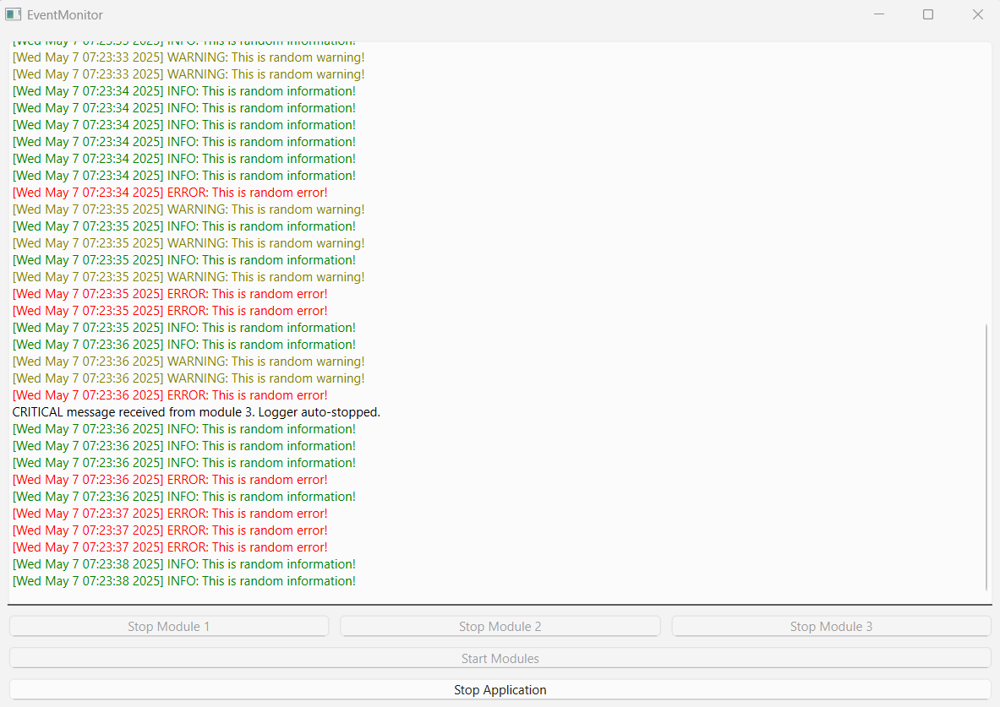

# Qt Multi-Client TCP Logger

This ongoing project is Qt-based application that functions as a TCP server designed to handle up to three concurrent clients (modules), each sending structured JSON messages. It features real-time message logging, GUI-based controls, error-handling mechanisms tailored for critical communication systems or monitoring tools and Writer that currently writes to a single session log file; per-module log files and advanced options are part of the ongoing development roadmap.

## Features

- Supports up to 3 TCP clients simultaneously
- Parses JSON messages with `clientId`, `type`, `message`, and `timestamp`
- GUI with real-time log view and control buttons for stopping individual modules
- Graceful disconnection and cleanup on critical failures
- Python script included for automated message triggering
- Logger system with bounded message queue and severity-based message discarding
- Writer that writes the log messages to separate txt files in a predefined directory (ongoing)

## UI Preview

This is a real-time log viewer showing messages from three simulated modules over TCP.
The GUI reacts to message severity—buttons are automatically disabled after CRITICAL messages.



## Message Format (JSON)
```json
{
  "client": 1,
  "type": "INFO", // INFO, WARNING, ERROR, CRITICAL
  "message": "Module started",
  "timestamp": "2025-05-06 06:29:51"
}
```

## Critical Behavior Logic
- If **module 3** sends a CRITICAL message → all modules are disconnected and the logger stops.
- If **module 1 or 2** sends CRITICAL message → only that module is stopped.
- If **module 3** sends a ERROR message → all three stop Module buttons are activated and the user can manually stop the modules.
- If **module 1 or 2** sends ERROR message → only that module"s stop button is activated.

## Build Instructions
1. Install Qt 6 or Qt 5.15+
2. Run `cmake` and `make` or open the project in Qt Creator
3. Launch the application and use the "Start Modules" button to begin listening

## Code Highlights
- `EventReceiver` inherits from `QTcpServer` and tracks client sockets in a `QMap`
- Uses `peek()` to non-destructively validate clientId before attaching handlers
- Ensures robust signal-safe disconnection via `deleteLater()` and deferred read triggering
- Fully event-driven, minimal blocking (500ms max on connection handshake)

## License
MIT License (or specify yours)

---

**Author:** Nikolaos Laskarelias

Feel free to adapt, extend, or integrate this logger with your own backend or UI requirements.

### TODO

## 🔧 Technical Improvements
- Expand the possible communication between the backend and frontend with WebSocket and REST
- Add second way of messaging formating (f.e CAN)
- Add a settings panel to adjust:
  - Message flush interval
  - Buffer size
  - Port number
  - Give the user the possibility to chose a communication method between TCPSocket, WebSocket or REST
  - Give the user the possibility to chose message formating


## Functional Extensions
- Support WebSocket or UDP modes for remote message streaming
- Add message statistics (count by type)
- Authentication/token for sender script (basic security)
- Use JSON schema validation for incoming messages

## Testing
- Add unit tests for `Logger` and `Writer `class
- Stress-test script: burst of messages at 5ms intervals

## Deployment
- Bundle release with standalone Python
- Add `.bat` or `.sh` launcher script for convenience
