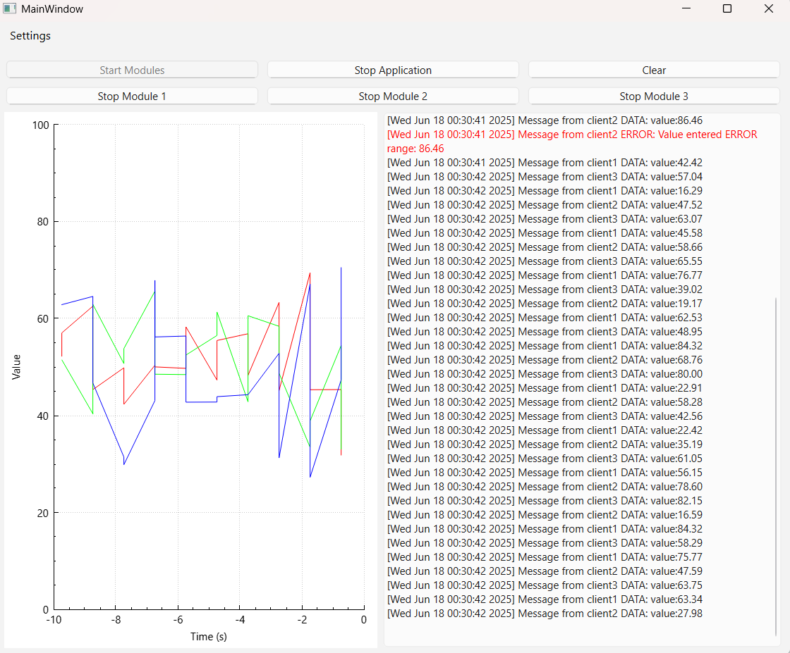
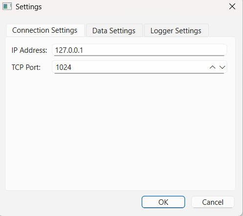
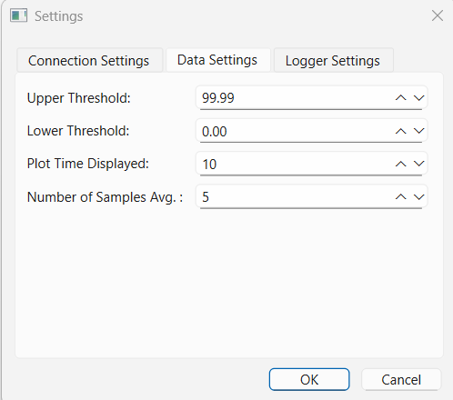
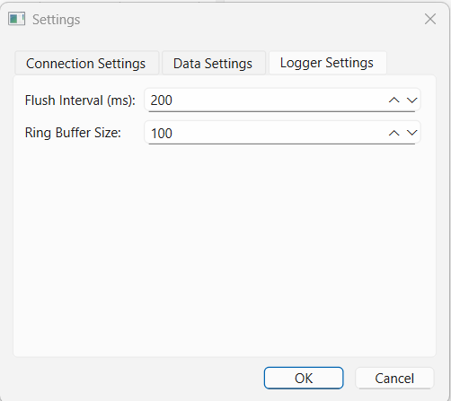

# Qt Multi-Client TCP Logger

This ongoing project is a Qt-based application that functions as a TCP server designed to handle up to three concurrent clients (modules), each sending structured JSON messages over TCP. It features real-time message logging, GUI-based controls, error-handling mechanisms tailored for critical communication systems or monitoring tools and Writer that currently writes to a single session log file, with module identifiers included in each entry for traceability; advanced options are part of the ongoing development roadmap. It also displays a basic graph using QCustomPlot of the incoming data points after some basic thresholding and filtering.

## Features

- Supports up to 3 TCP clients simultaneously
- Parses JSON messages with `clientId`, `type`, `message`, and `timestamp`
- GUI with real-time log view, control buttons for stopping individual modules and graph that shows sensor data for each client using a moving average of X values in 2D and X and Y values in 3D in relation to time.
  - 2D: QCustomPlot (default)
  - 3D: OpenGL (experimental)
- Settings dialog to configure: Port number, IP address, Plotting window duration, Thresholds for incoming sensor values, Flush interval and buffer size
- Graceful disconnection and cleanup on critical failures
- Python script included to simulate real client traffic with randomized message generation.
- Logger system with bounded message queue and severity-based message discarding
- Writer that writes the log messages to separate txt files in a predefined directory

## UI Preview

This is a real-time log viewer showing messages from three simulated modules over TCP.
The GUI reacts to message severity—buttons are automatically disabled after CRITICAL messages.






## Message Format (JSON)
```json
{
  "client": 1,
  "type": "INFO", // INFO, WARNING, ERROR, CRITICAL, DATA
  "message": "Module started",
  "timestamp": "2025-05-06 06:29:51"
}
```

## Critical Behavior Logic
- If **module 3** sends a CRITICAL message → all modules are disconnected and the application stops.
- If **module 1 or 2** sends CRITICAL message → only that module is stopped.
- If **module 3** sends a ERROR message → all three stop Module buttons are activated and the user can manually stop the modules.
- If **module 1 or 2** sends ERROR message → only that module"s stop button is activated.

## Build Instructions
1. Install Qt 6.8.3 (must include OpenGL and OpenGLWidgets modules) and CMake 3.28+
2. `cmake -S . -B build`
3. `cmake --build build`
4. `cd build`
5. run the executable
6. On Windows, ensure `glu32.lib` is available. On Linux, ensure OpenGL headers and libraries are installed (`libgl1-mesa-dev`, `libglu1-mesa-dev`).

## Code Highlights

### Architecture & Core Design
- Modular structure separating concerns across:
  - `Controller` — orchestrates module startup/shutdown, thread assignment, and connects all components
  - `EventReceiver` — manages TCP socket server, parses incoming JSON messages, detects CRITICAL state
  - `Logger` — filters and routes incoming messages based on type and module, emits logging signals
  - `Writer` — saves logs to disk with structured CSV formatting, handles safe file lifecycle
  - `MainWindow` — interactive Qt Widgets UI for live monitoring, user control, and data display
  - `Settings` — encapsulates runtime configuration (thresholds, ports, etc.), editable via GUI
  - `DataProcessor` — calculates rolling statistics and alerts for visual and logical analysis
  - `PythonProcessManager` — manages lifecycle of the Python-based client simulators
- Uses modern C++ practices:
  - `std::unique_ptr` for scoped ownership of threads and components
  - `QPointer<QTcpSocket>` to ensure signal safety across asynchronous lifetimes
- All cross-thread invocations use `QMetaObject::invokeMethod(..., Qt::BlockingQueuedConnection)` for synchronization
- Non-blocking design across all slots; designed for long-running stable execution

### Networking (EventReceiver)
- Accepts multiple TCP clients using `QTcpServer`, identifies clients by a JSON `client` field
- Tracks client sockets in `QMap<uint32_t, QPointer<QTcpSocket>>`
- Sets up `readyRead`, `disconnected`, and `destroyed` handlers with `QPointer`-safe lambdas
- Parses incoming JSON messages robustly:
  - Validates client ID, type field, and timestamp
  - Emits structured `EventMessage` instances
  - Emits error messages for malformed input
- Handles CRITICAL messages:
  - Client 3: triggers global shutdown of all clients
  - Clients 1 and 2: disconnects only the corresponding socket
- Uses deferred deletion via `deleteLater()` and fallback `abort()` with `QTimer`

### Message Handling (Logger)
- Buffers incoming `EventMessage` entries with a configurable max size
- Prioritizes `CRITICAL` and `ERROR` messages over lower-severity ones
- Periodically flushes one message at a time via a `QTimer`
- Passes flushed messages to Writer for persistence and to UI for live display
- Adjusts flush rate dynamically based on application state

### File Persistence (Writer)
- Writes flushed messages to a timestamped `.txt` log file in a `logs/` directory
- Each file is named as: `logger_<timestamp>.txt`
- Runs as a separate thread using `QThread` to ensure non-blocking I/O
- Supports graceful termination via `finish()` and `wait()`

### Data Processing (DataProcessor)
- Calculates averages of every 5 values of the recent `DATA` messages per client
- Routes processed values back to the main window for visualization

### UI & Visualization (MainWindow)

- Built with Qt Widgets and `QCustomPlot` for 2D real-time plotting
- Displays logs color-coded by message type (INFO, WARNING, etc.)
- Shows message content, timestamp, and client ID in a scrollable text area
- Includes three Stop Logger buttons (one per client)
- Supports `SettingsDialog` for buffer/flush control
- Planned OpenGL extension (toggleable via radio buttons) to visualize:
  - X: Raw sensor value
  - Y: Canonicalized value (0–100)
  - Z: Timestamp (OpenGL time-axis) (this is an ongoing change)

### Settings (SettingsDialog)

- Loads and saves user-defined settings using `QSettings`
- Provides UI to modify:
  - Logger flush interval
  - Max message ring buffer size
  - TCP ip address and port
  - low and upper threshold for the filtering of the data in the graph
  - window time of how many seconds will the graph show data


## License
MIT License (or specify yours)

## Known issues

~~As of 13.06.2025 The application crashes when the python script generates a critical error for module 3~~
Fixed on 17.06.2025: Crash caused by improper deletion of client sockets on CRITICAL messages from module 3 was resolved.
~~18.06.2025 Python proccess crashed when closing after a critical error in module 3.~~ Fixed
~~INFO, WARNING, ERROR messages are not displayed after a few seconds on the logger, only the DATA messages.~~ Fixed on 21.06.2025

---

**Author:** Nikolaos Laskarelias

Feel free to adapt, extend, or integrate this logger with your own backend or UI requirements.

### TODO

## Technical Improvements
- Explore alternative communication protocols between frontend and backend, including:
  - **WebSocket:** for real-time bidirectional message streaming (client ↔ server)
  - **REST API:** for structured control, querying, and persistent log submission
  - This includes manual JSON serialization/parsing and potential integration with PostgreSQL for durable log storage.
- ~~Refactor EventReceiver to use QThread per client socket to improve stability and avoid crashes due to cross-thread access or unexpected deletions. Current design using QTcpServer in the main thread is fragile under high traffic~~ Done in 21.06.2025
- Refactor Logger to run in its own thread to handle high-throughput message processing.
- ~~Current architecture is functional but has tightly coupling between UI and control logic. Refactoring planned to introduce an EventController for better separation of concerns (UI vs. logic vs. transport).~~ Done in 07.07.2025
- ~~Extend visualization support with an **OpenGL-based 3D graph mode** to render the new dual-value message format (`X` for raw input, `Y` for canonicalized [0–100] scale) over time; toggleable via radio buttons to switch between 2D (`QCustomPlot`) and 3D (OpenGL) modes. (ongoing change as of 07.07.2025)~~ (implemented on 16.07.2025)
- Add QCustomPlot as a dynamic library and not as a static as it is increasing the time for building.
- Add support for **MQTT** as a communication method between system components, using a publish/subscribe architecture via an MQTT broker
- Add second way of messaging formating (f.e **XML**, **Protobuf**)
- Add a settings panel to adjust:
  - Give the user the possibility to chose a communication method between TCPSocket, WebSocket or REST
  - Give the user the possibility to chose message formating


## Functional Extensions
- Support WebSocket or UDP modes for remote message streaming
- Graphical message statistics (e.g., number of errors)
- Authentication/token for sender script (basic security)
- Use JSON schema validation for incoming messages

## Testing
- Add unit tests for `Logger` and `Writer `class
- Stress-test script: burst of messages at 5ms intervals

## Deployment
- Bundle release with standalone Python
- Add `.bat` or `.sh` launcher script for convenience
